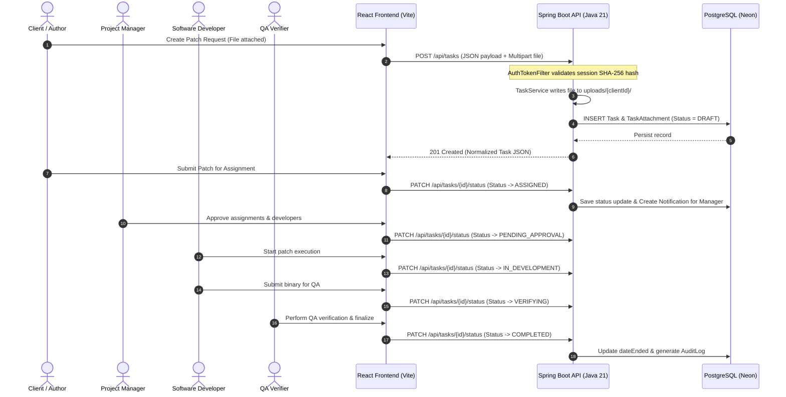
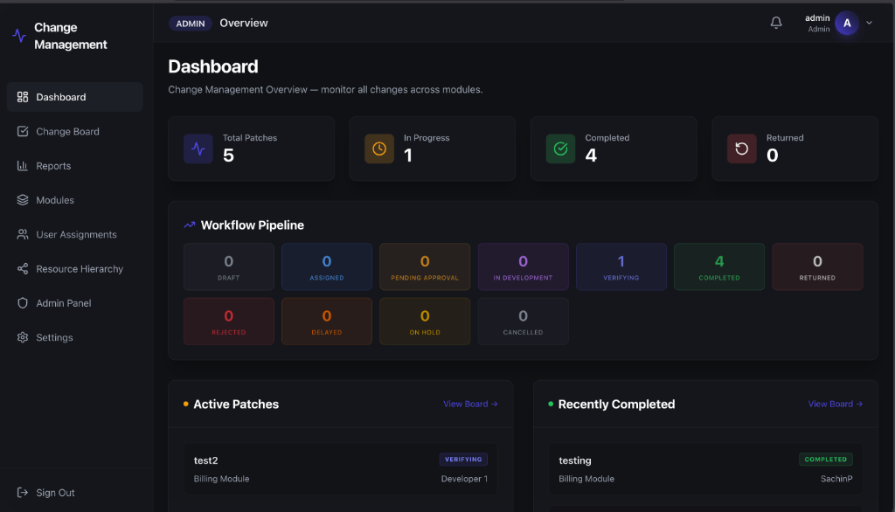
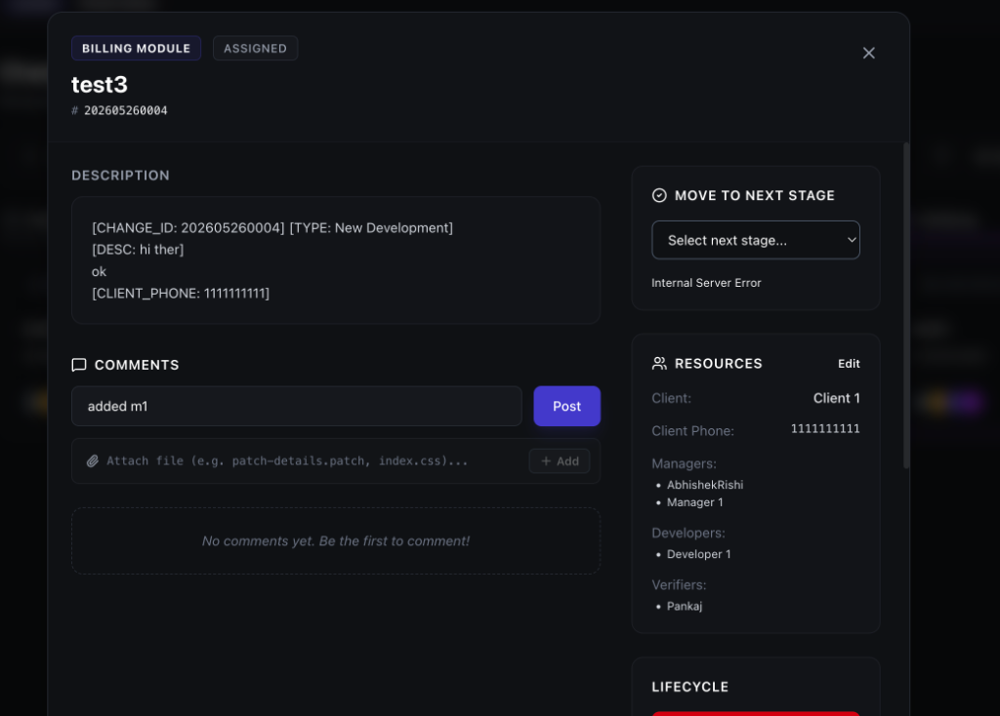
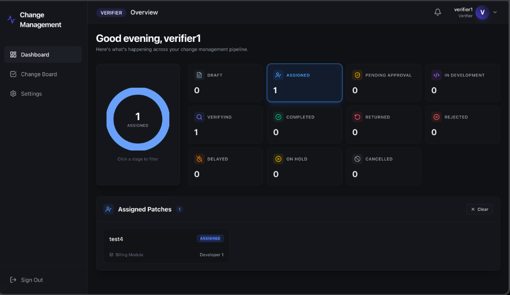
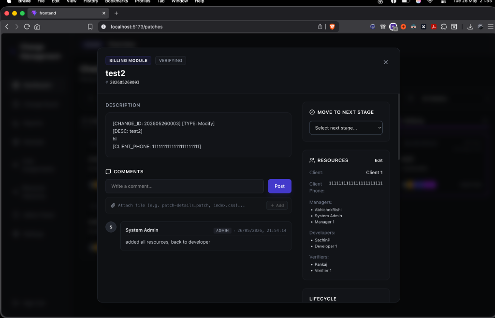

# PatchFlow: Enterprise Patch & Release Governance Platform

Welcome to the **PatchFlow** technical architecture and operations guide. PatchFlow is an enterprise-grade release governance and workflow tracking system. It enforces strict role-based lifecycle transitions for deployment patches, configuration modifications, and database schema updates.

---

## 1. Problem Space & Business Case

### The Problem
In enterprise software development, deploying patches to staging, production, or client-isolated environments without a centralized governance mechanism introduces severe operational risks:
* **Untracked Deployments:** Ad-hoc database alterations and configuration updates occur without centralized logging or clear lineage.
* **Workflow Status Drift:** Status updates (e.g., "In Development" to "Completed") are updated manually without validating whether the user is authorized or if prerequisites (e.g., QA verification) are met.
* **Security & Audit Failures:** Regulatory audits require immutable proof of *who* requested a change, *who* approved the codebase alteration, *who* verified the patch, and *what* was uploaded.
* **Unstructured File/Asset Management:** Patch binaries, database scripts, and client requirement files are often uploaded to generic cloud folders, lacking ownership boundaries and directory structure.
* **Lazy Query Latency:** Standard microservices architectures suffer from database latency (N+1 queries) when fetching complex multi-user/multi-module task relationships over remote PostgreSQL pools.

### The Solution: PatchFlow Approach
PatchFlow addresses these challenges through a secure, high-performance web platform featuring:
* **Deterministic State Machine Enforcer:** Code-level validation restricting transitions to specific authorized user roles.
* **Interactive Metrics Dashboard:** Real-time visual metrics showing patch distributions across all lifecycle stages with clickable filters and SVG charts.
* **Multi-Role Kanban Workspace:** Kanban board split by development status with quick-action toggles (e.g., to view soft-deleted patches).
* **Isolated Client-Based Sandbox Store:** Real-time upload service saving attachments under client-specific directories (`uploads/{clientId}/`).
* **Immutable Audit Trail:** Logging of every state change, assigning user, verifier, and action timestamps.
* **Eager-Loaded Relationship Layer:** `JOIN FETCH` queries reducing API response times to **< 30ms** on Neon Postgres clouds.

---

## 2. Platform Architecture & Data Flow



---

## 3. Strict State Machine Lifecycle

The platform enforces a unidirectional/conditional state machine to ensure patches flow logically from creation to completion:

| Current Status | Target Status | Authorized Roles | Action Description |
| :--- | :--- | :--- | :--- |
| **DRAFT** | `ASSIGNED` | CLIENT, Admin, Task Author | Submits the patch request and assigns it to managers. |
| **ASSIGNED** | `PENDING_APPROVAL` | MANAGER, ADMIN | Approves the managers, developers, and QA verifiers assigned. |
| **PENDING_APPROVAL** | `IN_DEVELOPMENT` | MANAGER, ADMIN, Team Manager | Approves starting developer operations. Sets `dateStarted`. |
| **IN_DEVELOPMENT** | `VERIFYING` | Assigned DEVELOPER | Indicates coding is finished; hands over patch to QA verifiers. |
| **VERIFYING** | `COMPLETED` | Assigned VERIFIER | Confirms QA testing passed. Sets `dateEnded` (Terminal status). |
| **VERIFYING** | `RETURNED_TO_DEVELOPER` | Assigned VERIFIER | Verification failed; returns patch for rework. |
| **VERIFYING** | `REJECTED` | Assigned VERIFIER | Reject change request completely (Terminal status). |
| **VERIFYING** | `DELAYED` | Assigned VERIFIER | Delay patch implementation (can move back to Development). |
| **VERIFYING** | `ON_HOLD` | Assigned VERIFIER | Hold patch implementation (can move back to Development). |
| **VERIFYING** | `CANCELLED` | Assigned VERIFIER | Cancel patch request (Terminal status). |

*Note: System Administrators bypass state constraints for emergency releases.*

---

## 4. Technical Stack Details

### Frontend Web Application
* **Framework Engine:** React 19.2.6 & TypeScript 6.0.2 (strict compilation).
* **Build System:** Vite 8.0.14 (super-fast Hot Module Replacement).
* **Styling & Theme:** Tailwind CSS 4.3.0 utilizing a custom glassmorphism configuration, vibrant dark-mode gradients, and smooth state-change micro-animations.
* **State Management:** Zustand 5.0.13 with persistent client storage middleware (`auth-storage`).
* **Icons & Assets:** Lucide React 1.14.0.
* **Export Utilities:** XLSX Sheets (`xlsx` v0.18.5) for tabular report exporting.

### Backend REST API
* **Language Runtime:** Java 21 (LTS).
* **Application Framework:** Spring Boot 3.3.5.
* **Object-Relational Mapping (ORM):** Hibernate 6 / Spring Data JPA.
* **Database Driver:** PostgreSQL JDBC Driver.
* **Authentication Engine:** BCrypt-based security hashing & SHA-256 session mapping filter.
* **JSON Serialization:** Jackson Databind.
* **Build & Dependency Automation:** Apache Maven 3.9+.

---

## 5. Directory & Codebase Structure

### Backend Architecture (`/backend`)
```
backend/
├── pom.xml                               # Maven project dependencies and build plugins
└── src/main/java/com/patchflow/
    ├── PatchFlowApplication.java         # Spring Boot entry point
    ├── config/                           # Configuration layer
    │   ├── Auth.java                     # Utility helper functions validating request identities
    │   ├── DataSeeder.java               # Seeds default users, active modules, and DB permissions
    │   ├── SecurityConfig.java           # BCrypt password encoder initialization
    │   ├── UUIDStringConverter.java      # JPA AttributeConverter for PostgreSQL UUID mappings
    │   └── WebConfig.java                # CORS origins and AuthTokenFilter registration
    ├── controller/                       # REST endpoint definitions
    │   ├── AuthController.java           # Sessions login/logout endpoints
    │   ├── HealthController.java         # Simple health check endpoint
    │   ├── ModuleController.java         # Module hierarchies and assignment endpoints
    │   ├── NotificationController.java   # Retrieves notifications triggered by workflow events
    │   ├── ReportController.java         # Handles audit trails and in-memory reports processing
    │   ├── TaskController.java           # Handles CRUD, file uploads, comments, and state updates
    │   └── TeamController.java           # Retrieves development teams
    ├── entity/                           # JPA Database Entities
    │   ├── AppModule.java                # Mapping for NSC, DND, CSC, BILLING, etc.
    │   ├── AuditLog.java                 # Immutable tracking of every status change
    │   ├── Notification.java             # User notification records
    │   ├── Project.java                  # Holds high-level modules grouping
    │   ├── Session.java                  # Stores hashed session tokens mapped to active users
    │   ├── StatusHistory.java            # Records stage change reasons and actor tags
    │   ├── Task.java                     # Central Patch entity holding managers, developers, verifiers
    │   ├── TaskAttachment.java           # Holds names, types, sizes, and sandbox store URLs
    │   ├── TaskComment.java              # User comments with support for file links
    │   ├── Team.java                     # Represents structural developer divisions
    │   ├── User.java                     # Defines roles, hashed credentials, and active states
    │   └── UserManager.java              # Direct many-to-many relationship mapping managers to juniors
    ├── filter/                           # Servlet filter layer
    │   └── AuthTokenFilter.java          # Intercepts requests, hashes Bearer token, fetches user session
    └── repository/                       # Spring Data JPA Repository interfaces
        ├── AppModuleRepository.java
        ├── AuditLogRepository.java
        ├── NotificationRepository.java
        ├── ProjectRepository.java
        ├── SessionRepository.java
        ├── StatusHistoryRepository.java
        ├── TaskRepository.java           # Declares eager JOIN FETCH queries for optimal latency
        ├── TeamRepository.java
        ├── UserManagerRepository.java
        └── UserRepository.java
```

### Frontend Architecture (`/frontend`)
```
frontend/
├── package.json                          # Vite and React dependencies
├── vite.config.ts                        # Dev-server port routing and compilation mappings
├── index.html                            # Root HTML template
└── src/
    ├── main.tsx                          # App initialization entry point
    ├── App.tsx                           # Defines React routing, route protection, and boundaries
    ├── index.css                         # CSS design system (Tailwind imports and custom animations)
    ├── api/                              # HTTP clients
    │   ├── client.ts                     # Axios wrapper injection, header interceptor, and 401 hooks
    │   ├── modules.ts                    # Handles API calls for modules and assignments
    │   ├── tasks.ts                      # Handles API calls for patch operations, comments, and uploads
    │   └── users.ts                      # Handles API calls for user accounts operations
    ├── store/                            # Zustand store declarations
    │   └── authStore.ts                  # Persisted authorization and user session state
    ├── components/                       # Shared layout and details interfaces
    │   ├── CreatePatchModal.tsx          # Panel capturing patch inputs, modules, assignments, and files
    │   ├── ErrorBoundary.tsx             # Catches and reports React rendering errors gracefully
    │   ├── Layout.tsx                    # Houses Sidebar, Topbar, and Outlet pages mapping
    │   ├── layout/
    │   │   └── SwitchAccountDropdown.tsx # Account switcher dropdown allowing dynamic login changes
    │   └── patches/
    │       ├── PatchDetailsModal.tsx     # Details modal, comments feed, timeline and file downloads
    │       └── PatchStatusBadge.tsx      # Renders clean, color-coded badges matching status
    └── pages/                            # Navigable views mapped by React Router
        ├── AdminPage.tsx                 # Superadmin panel to add users, edit details, reset passwords
        ├── Dashboard.tsx                 # Metrics page with dynamic SVGs and click-to-open tasks
        ├── Login.tsx                     # Form capturing username and passwords
        ├── ModuleAssignmentsPage.tsx     # Grid showing manager mappings to modules
        ├── ModulesPage.tsx               # Enables creation and toggle states of system modules
        ├── PatchBoardPage.tsx            # Kanban view showing active and soft-deleted columns
        ├── ReportsPage.tsx               # Filters tasks by date range and exports report to Excel
        └── ResourceHierarchyPage.tsx     # Nested structural hierarchy visualization
```

---

## 6. Setup & Execution Instructions

Ensure you have the following installed locally:
* **Java Development Kit (JDK) 21**
* **Maven 3.9+**
* **Node.js 20+**
* **PostgreSQL Database** (or access to Neon Cloud instance)

### 1. Database Configuration
Verify the Spring Boot database configuration by editing `backend/src/main/resources/application.properties` or passing a `DATABASE_URL` environment variable during run execution.

Example Connection String:
`jdbc:postgresql://<host>:<port>/<db_name>?sslmode=require&user=<user>&password=<password>`

### 2. Run Backend API Server
Navigate to the backend directory, compile packages, and boot the server:
```bash
cd backend
mvn clean compile
DATABASE_URL="jdbc:postgresql://..." mvn spring-boot:run
```
The backend server will run on `http://localhost:8080`.

### 3. Run Frontend Web App
Navigate to the frontend directory, install dependencies, and start the development server:
```bash
cd frontend
npm install --legacy-peer-deps
npm run dev
```
The web app will boot locally on `http://localhost:5173`.

---

## 7. Demo Accounts & Access Matrix

All seeded demo accounts are configured with the default password: **`upcl@123`**

| Core Profile / Designation | Username | Role Mapping | Purpose / Capabilities |
| :--- | :--- | :--- | :--- |
| **System Administrator** | `admin` | `ADMIN` | Full CRUD operations, user management, module deletions. |
| **Project Manager** | `abhishek_rishi` | `MANAGER` | Approves assignment pipelines, manages development teams. |
| **Project Manager** | `prashantp` | `MANAGER` | Approves assignment pipelines, manages development teams. |
| **Project Manager** | `abhishiek_r` | `MANAGER` | Approves assignment pipelines, manages development teams. |
| **Project Manager** | `manager1` | `MANAGER` | Approves assignment pipelines, manages development teams. |
| **Software Developer** | `siva` | `DEVELOPER` | Commits patches, uploads files, moves tasks to `VERIFYING`. |
| **Software Developer** | `trinadh` | `DEVELOPER` | Commits patches, uploads files, moves tasks to `VERIFYING`. |
| **Software Developer** | `anukriti` | `DEVELOPER` | Commits patches, uploads files, moves tasks to `VERIFYING`. |
| **Software Developer** | `sachinp` | `DEVELOPER` | Commits patches, uploads files, moves tasks to `VERIFYING`. |
| **Software Developer** | `developer1` | `DEVELOPER` | Commits patches, uploads files, moves tasks to `VERIFYING`. |
| **QA Engineer / Verifier** | `pankaj` | `VERIFIER` | Tests patches, moves status to `COMPLETED` or `RETURNED`. |
| **QA Engineer / Verifier** | `jagdish` | `VERIFIER` | Tests patches, moves status to `COMPLETED` or `RETURNED`. |
| **QA Engineer / Verifier** | `verifier` | `VERIFIER` | Tests patches, moves status to `COMPLETED` or `RETURNED`. |
| **QA Engineer / Verifier** | `verifier1` | `VERIFIER` | Tests patches, moves status to `COMPLETED` or `RETURNED`. |
| **Client Owner** | `komal` | `CLIENT` | Submits new requests, monitors progress, downloads uploads. |
| **Client Owner** | `client1` | `CLIENT` | Submits new requests, monitors progress, downloads uploads. |
| **UPCL Client Viewer** | `upclviewer1` | `UPCL_VIEWER` | Read-only observation of reports and active pipelines. |
| **General Viewer** | `admin1` | `VIEWER` | Read-only observation of reports and active pipelines. |

---

## 8. Screen Walkthrough & Reference Views

### 1. Interactive Metrics Dashboard
Aggregates live statistics distribution with dynamic status cards to filter active patches on demand.


### 2. Multi-Role Kanban Board
Renders development stages sequentially, with a dedicated toggle for admins to view soft-deleted patches.


### 3. Patch Details & Isolated File Sandbox
Manage assignments, comments feeds, and upload binary files directly to the client's storage folder.


### 4. Custom Report Generator
Generate tabular logs filtering by dates, modules, or users, with clean sheet exports to Excel.

