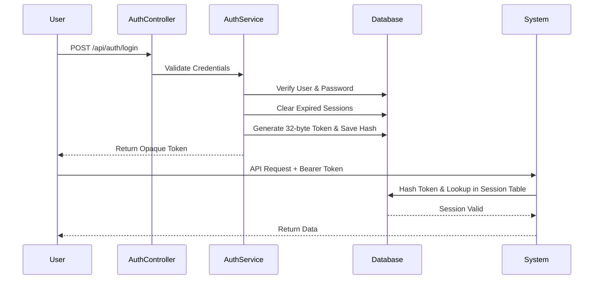
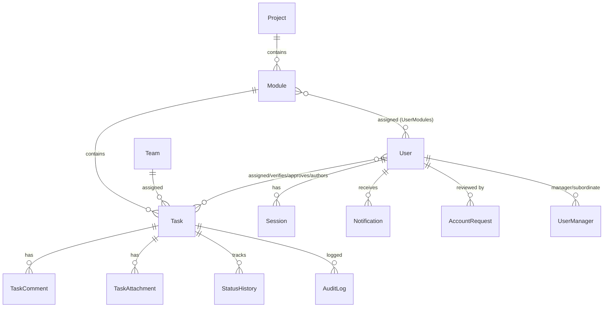

# PatchFlow Database Explainer

## 1. Executive Summary

PatchFlow is a workflow management system built to manage and track project components efficiently. In simple terms:

**Users** are organized to work on **Projects**.  
Projects are broken down into **Modules**.  
Modules contain **Tasks** (the core unit of work).  
Tasks accumulate **Comments**, **Attachments**, and **Status Changes** throughout their lifecycle.  
All significant activities trigger **Notifications** and are recorded in the **Audit** logs.

> [!IMPORTANT]
> **Task is the central business entity.** The entire database architecture revolves around assigning, tracking, and completing Tasks.

---

## 2. Database Overview Table

| Table | Purpose | Category | Criticality |
| ----- | ------- | -------- | ----------- |
| `change_req_User` | System users | Authentication | Tier 1 |
| `change_req_Session` | Active login sessions | Authentication | Tier 1 |
| `change_req_Project` | Top-level business container | Core Business | Tier 1 |
| `change_req_Module` | Sub-division of projects | Core Business | Tier 1 |
| `change_req_Task` | Core business record | Core Business | Tier 1 |
| `change_req_UserManager` | Manager-subordinate hierarchy | Authorization | Tier 2 |
| `change_req_UserModules` | User to Module access mapping | Authorization | Tier 2 |
| `change_req_TaskManagers` | Task Manager assignments | Core Business | Tier 2 |
| `change_req_TaskDevelopers` | Task Developer assignments | Core Business | Tier 2 |
| `change_req_TaskVerifiers` | Task Verifier assignments | Core Business | Tier 2 |
| `change_req_TaskComment` | Task discussions | Core Business | Tier 2 |
| `change_req_TaskAttachment`| Uploaded evidence/documents | Core Business | Tier 2 |
| `change_req_StatusHistory` | Tracks status transitions | Workflow | Tier 2 |
| `change_req_Team` | Grouping users and work | Core Business | Tier 3 |
| `change_req_AccountRequest`| Onboarding approval workflow | Administration | Tier 3 |
| `change_req_Notification` | Stores user notifications | Notification | Tier 3 |
| `change_req_AuditLog` | Tracks who changed what | Audit | Tier 3 |

---

## 3. Authentication & Authorization

### change_req_User
**Purpose:** Stores system users.
**Key fields:** `userId`, `username`, `passwordHash`, `role`, `isActive`, `email`, `phone`
**Used by:** `AuthController`, `AuthService`, `UserController`
**Business explanation:** Represents every person who can use PatchFlow, whether they are an administrator, a client, a manager, or a developer.

### change_req_Session
**Purpose:** Stores active login sessions.
**Explain:** PatchFlow does **NOT** use JWT. Instead, it uses opaque tokens generated during login and stored in the Session table as a SHA-256 hash. The `AuthTokenFilter` intercepts requests, hashes the provided Bearer token, and validates it against this table.



### change_req_UserManager
**Purpose:** Manager-subordinate hierarchy.
**Example:** A Developer is mapped to their Manager. This allows managers to view reports and aggregate data for their subordinates.

### change_req_UserModules
**Purpose:** Access control mapping between Users and Modules.
**Example:** An Admin might have access to all modules, whereas a Developer might be restricted to the NSC module only.

### change_req_AccountRequest
**Purpose:** User onboarding and account approval workflow. Captures public sign-ups that require an administrator's approval before becoming a full `change_req_User`.

---

## 4. Core Business Tables

### change_req_Project
**Purpose:** Top-level business container.
**Example:** UPCL Modernization Project.

### change_req_Module
**Purpose:** Sub-division of projects.
**Example:** NSC, DND, CSC, Billing.

### change_req_Task
**Purpose:** Core business record.
**Description:** This is the most important table in the application. It acts as the anchor for the entire workflow. 
- **Author:** The creator of the task.
- **Assignee:** The primary person responsible for the task.
- **Approver/Verifier:** Users tasked with reviewing and verifying the completion of the work.
- **Module & Team:** The module this task belongs to and the team executing it.
- **Status:** The current state of the task in its lifecycle.

**Task Lifecycle:**
Tasks progress through defined statuses (e.g., DRAFT → OPEN → IN_PROGRESS → UAT → VERIFIED → DEPLOYED), driving the business engine forward.

### change_req_TaskComment
**Purpose:** Task discussions and communication history among team members.

### change_req_TaskAttachment
**Purpose:** Uploaded evidence, specification documents, or logs attached directly to tasks.

### change_req_TaskManagers / change_req_TaskDevelopers / change_req_TaskVerifiers
**Purpose:** Many-to-many role mappings.
**Explanation:** Because a single task might require collaboration from multiple developers, oversight from multiple managers, and validation from multiple verifiers, these separate join tables allow flexible many-to-many assignments without cluttering the primary `Task` table.

### change_req_Team
**Purpose:** Grouping users and work assignments for collective tracking and resource management.

---

## 5. Workflow & Audit Tables

### change_req_StatusHistory
**Purpose:** Tracks status transitions.
**Example:** `OPEN` → `IN_PROGRESS` → `DEV_COMPLETE` → `UAT` → `VERIFIED` → `DEPLOYED`
**Reporting Use Cases:** Used extensively by `ReportController` to calculate turnaround times, identify bottlenecks, and measure team velocity.

### change_req_AuditLog
**Purpose:** Tracks who changed what and when.
**Example:** User created, Role updated, Task modified. Provides a non-repudiable history for compliance and troubleshooting.

---

## 6. Notifications

### change_req_Notification
**Purpose:** Stores user notifications.
**Explanation:** Captures system alerts, deadline reminders, and task assignment alerts. In the future, this table will serve as the source-of-truth for integrations with company notification services (e.g., SMS, WhatsApp, Email).

---

## 7. Entity Relationship Diagram



---

## 8. Architecture Flow

```mermaid
flowchart TD
    %% Architecture Flow
    Client[Client / Web App] --> Controllers
    
    subgraph Spring Boot Application
        Controllers[Controllers layer<br/>(e.g., TaskController, AuthController)]
        Services[Services layer<br/>(e.g., TaskService, AuthService)]
        Repositories[JPA Repositories<br/>(e.g., TaskRepository, SessionRepository)]
    end
    
    Controllers --> Services
    Services --> Repositories
    Repositories --> Database[(PostgreSQL Database)]
```

---

## 9. Most Important Tables

### Tier 1 (Application cannot function)
- `change_req_User`
- `change_req_Session`
- `change_req_Task`
- `change_req_Project`
- `change_req_Module`
*Why:* These tables form the absolute backbone of the system. Without Users and Sessions, no one can log in. Without Projects, Modules, and Tasks, there is no work to track.

### Tier 2 (Business workflow)
- `change_req_StatusHistory`
- `change_req_TaskComment`
- `change_req_TaskAttachment`
- `change_req_UserModules`
- `change_req_UserManager`
*Why:* These handle the collaboration, state management, and authorization rules that make the application useful for an enterprise team.

### Tier 3 (Support feature)
- `change_req_Notification`
- `change_req_AuditLog`
- `change_req_Team`
- `change_req_AccountRequest`
*Why:* These provide essential administrative, compliance, and onboarding support but do not stop the core task execution if they are temporarily degraded.

### Tier 4 (Utility/Test)
- *TEST*
*Why:* Any temporary, experimental, or test tables that are not part of the primary business domain.

---

## 10. Recent Authentication Fixes (June 2026)

- **SessionRepository mapping corrected:** Updated to target the `change_req_Session` table using native queries.
- **AuthTokenFilter updated:** Configured to populate `SecurityContextHolder` with the authenticated user and authorities to pass `.anyRequest().authenticated()` constraints.
- **Login flow verified:** Confirmed password hashing matching and opaque token generation.
- **Company PostgreSQL integration verified:** Connected to `10.1.2.24` successfully.
- **CRUD operations verified:** Tested successfully under the new security context rules.
- **Session-based authentication confirmed operational:** System is fully utilizing opaque token-based auth without JWT.

---

## 11. New Developer Onboarding Section

**1. Which table should I inspect first?**
Always start with `change_req_Task`. It connects almost every entity in the database (Users, Modules, Teams, Comments, Attachments, StatusHistory). Understanding the `Task` entity means understanding PatchFlow.

**2. How does login work?**
A user POSTs their credentials. If valid, `AuthService` generates a 32-byte secure token, hashes it using SHA-256, and stores the hash in `change_req_Session`. The plain token is returned to the client and must be passed as a `Bearer` token in subsequent requests.

**3. How are tasks assigned?**
Tasks have an `assigneeId` for the primary worker, but they also use join tables (`change_req_TaskManagers`, `change_req_TaskDevelopers`, `change_req_TaskVerifiers`) for complex multi-person assignments and oversight.

**4. How is authorization enforced?**
Authorization relies on the `role` column in `change_req_User`, hierarchical mappings in `change_req_UserManager`, and module restrictions in `change_req_UserModules`. The `AuthTokenFilter` loads the user role into Spring Security's `SecurityContextHolder` on every request.

**5. Which tables should never be modified directly?**
Do not manually insert or alter rows in `change_req_AuditLog` and `change_req_StatusHistory`. These are system-managed ledgers critical for compliance, reporting, and historical accuracy. Modifying them directly undermines the system's integrity.
